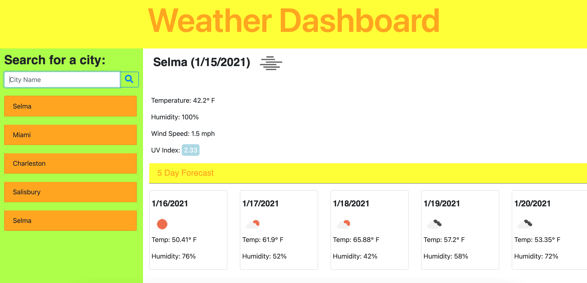
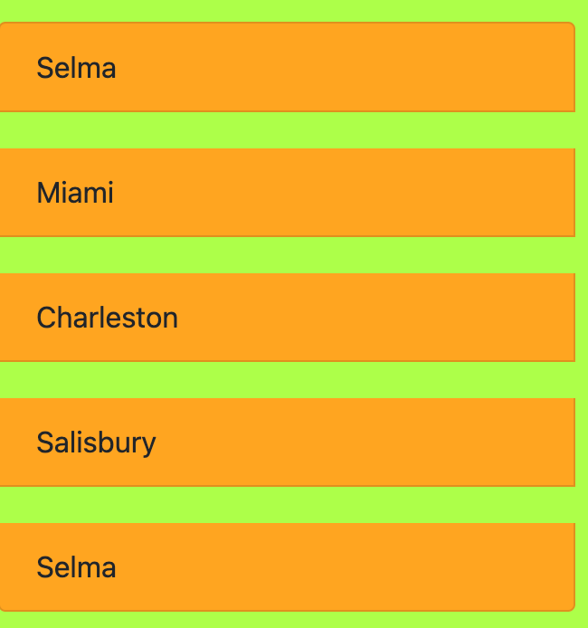

# Weather-Dashboard

***Description***

This Weather Dashboard was designed to display the current and five day forecast of the searched city. Users are able to search these cities and their weather using API (Applicaton Programmig Interface ) keys from 
 http://osp123.github.io/tutorials/html/weatherAPI.html .

***Installation***

https://imanid-code.github.io/Weather-Dashboard/

***Usage***

This  is the layout of The Weather Dashboard. 

On the left under the header SEARCH FOR CITY: 

, is a input box where users input the city and find out their current weather along with the 5 day forecast. 

The five most recently searched cities will remain in the search column. 

